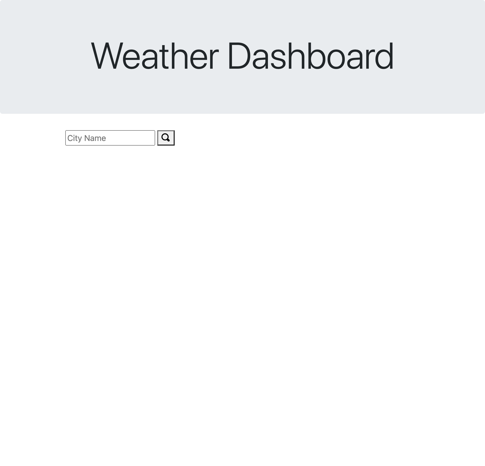

# weather-dashboard

This website allows user to look up the weather in a desired city. It will show the forecast for today including: temperature, humidity, wind speed and uv index. It also allows the user to see the forecast for the next five days which includes: the date, temperature, humidity and an icon that depicts the weather for that day. It saves each city into local storage so that when you refresh the page it will populate into a column on the left so the user can quickly switch back and forth, meanwhile clearing the page so that it does not show more than one city at once. 

[link to my website](https://ryannekillian.github.io/weather-dashboard/)

